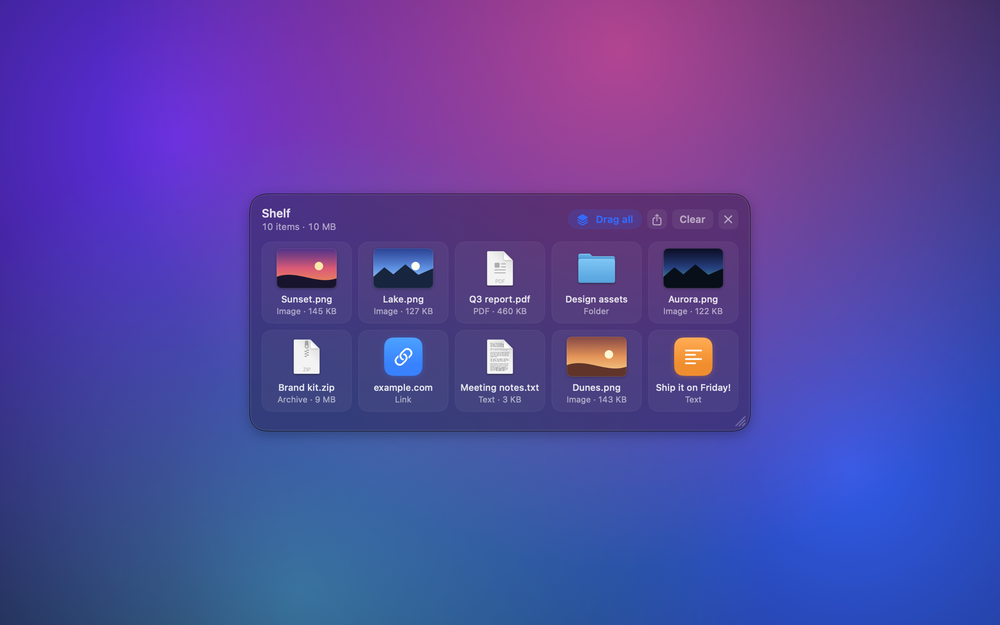
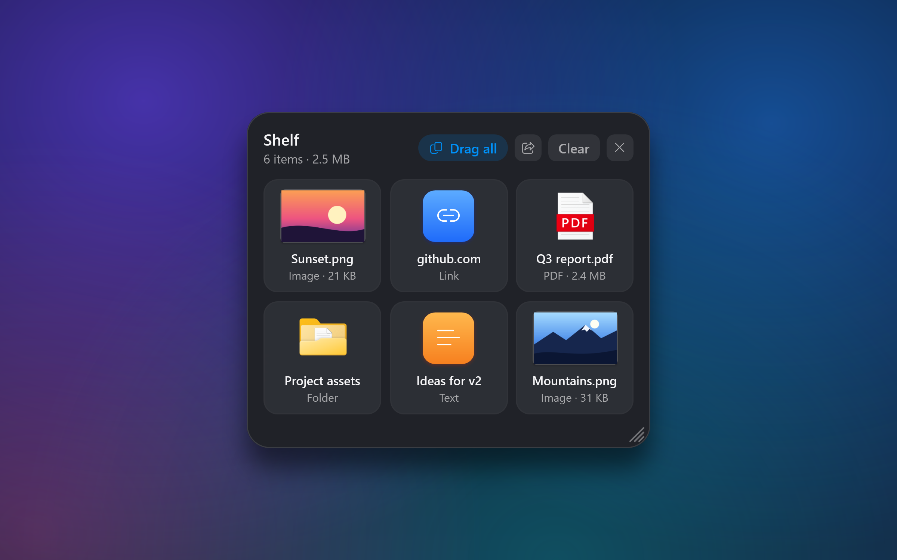
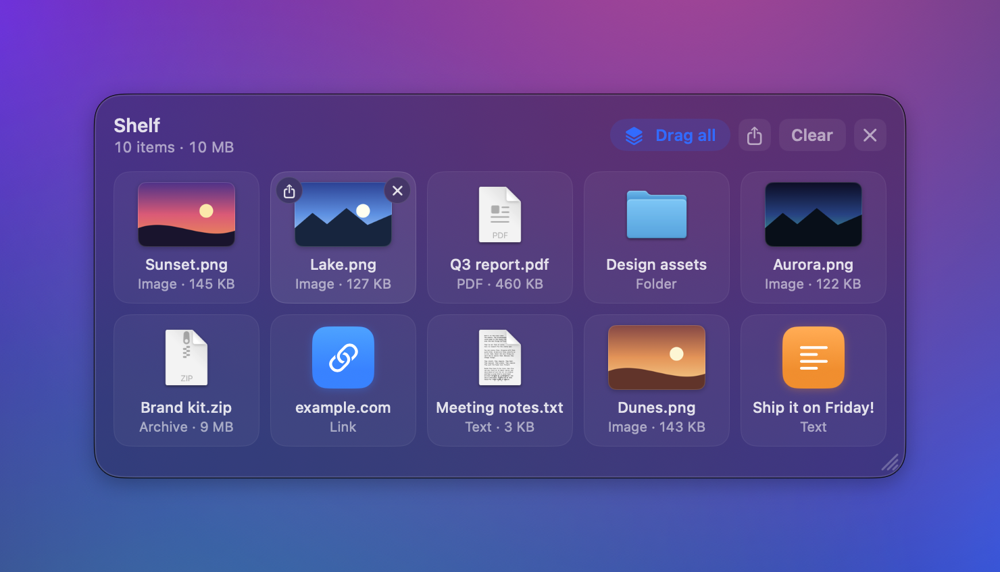
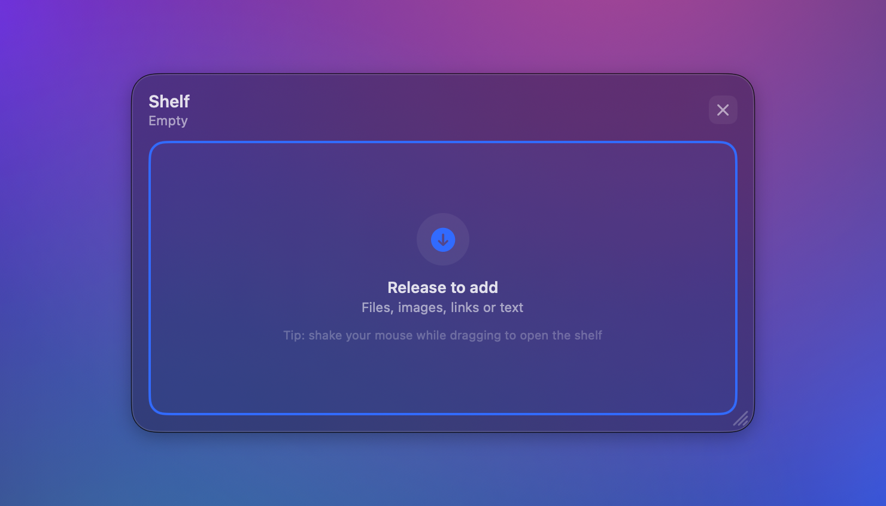
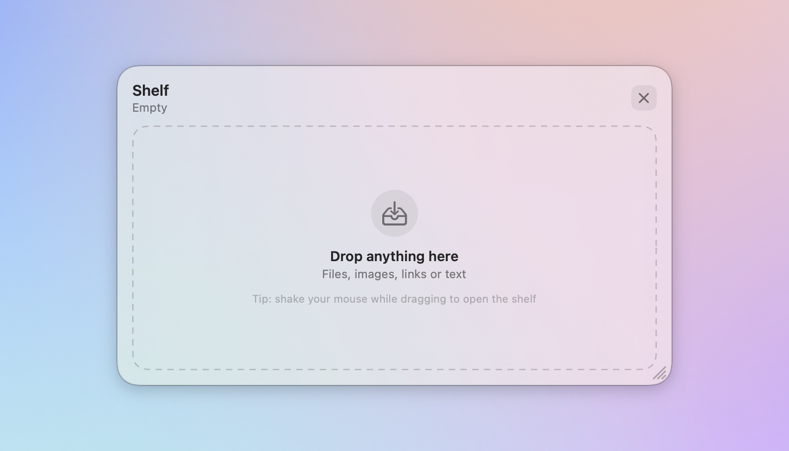

# ShelfDrop

Một cái kệ tạm cho file. Đang kéo file mà chưa có chỗ để thả thì lắc chuột ngang, kệ sẽ nổi lên ngay dưới con trỏ. Thả file vào đó, sang app khác kéo thêm, rồi kéo cả nhóm ra chỗ cần. Kệ nhận file, thư mục, ảnh, link và đoạn văn. Ý tưởng lấy từ Dropover.

Có hai bản riêng, dùng giống nhau:

| | macOS | Windows |
|---|---|---|
| Tải về | [Bản mới nhất (.dmg)](https://github.com/Dat98it/ShelfDrop/releases/latest) | [ShelfDrop-Setup-0.1.0.exe](https://github.com/Dat98it/ShelfDrop/releases/download/win-v0.1.0/ShelfDrop-Setup-0.1.0.exe) (70 MB) |
| Yêu cầu | macOS 14 trở lên | Windows 10 (1809) trở lên, 64-bit |
| Viết bằng | Swift, AppKit + SwiftUI | C#, .NET 8, WPF |
| Chi tiết | [phần macOS](#macos) | [phần Windows](#windows) |

<p align="center"> </p>

## Mục lục

- [Tình trạng](#tình-trạng)
- [macOS](#macos)
  - [Tính năng của bản macOS](#tính-năng-của-bản-macos)
  - [Ảnh chụp màn hình](#ảnh-chụp-màn-hình)
  - [Yêu cầu](#yêu-cầu)
  - [Build và chạy](#build-và-chạy)
  - [Đóng gói thành file .dmg](#đóng-gói-thành-file-dmg)
  - [Cách dùng](#cách-dùng)
  - [Dữ liệu và cấu hình](#dữ-liệu-và-cấu-hình)
  - [Gỡ cài đặt (macOS)](#gỡ-cài-đặt-macos)
  - [Phát triển](#phát-triển)
  - [Hạn chế đã biết](#hạn-chế-đã-biết)
  - [Hướng phát triển](#hướng-phát-triển)
- [Windows](#windows)
  - [Tính năng của bản Windows](#tính-năng-của-bản-windows)
  - [Cài đặt](#cài-đặt)
  - [Cách hoạt động (Windows)](#cách-hoạt-động-windows)
  - [Cấu trúc mã nguồn (Windows)](#cấu-trúc-mã-nguồn-windows)
  - [Build và test](#build-và-test)
  - [Tự động kiểm tra (GitHub Actions)](#tự-động-kiểm-tra-github-actions)
  - [Đã kiểm chứng đến đâu](#đã-kiểm-chứng-đến-đâu)
  - [Giới hạn đã biết](#giới-hạn-đã-biết)
- [Cấu trúc repo](#cấu-trúc-repo)
- [Giấy phép](#giấy-phép)


## Tình trạng

- macOS: dùng được, đã có các bản phát hành ([danh sách](https://github.com/Dat98it/ShelfDrop/releases)).
- Windows: đã có bản 0.1.0 ([ghi chú phát hành](https://github.com/Dat98it/ShelfDrop/releases/tag/win-v0.1.0)). Mã được build và chạy thử tự động trên một máy Windows của GitHub (lắc mở kệ, kéo thả vào và ra, nhớ vị trí và cỡ, trình cài đặt), nhưng chưa ai thử trên máy Windows thật. Chỗ nào đã kiểm, chỗ nào chưa, xem ở [Đã kiểm chứng đến đâu](#đã-kiểm-chứng-đến-đâu).

## macOS

Mã nguồn ở `macos/`, viết bằng Swift (AppKit + SwiftUI) và build bằng SwiftPM nên không cần Xcode.

[Tải bản .dmg](https://github.com/Dat98it/ShelfDrop/releases/latest), mở file rồi kéo `ShelfDrop` vào `Applications`. App chưa được notarize nên lần đầu mở, macOS sẽ chặn. Cách cho phép nằm ở [Cài trên máy khác](#cài-trên-máy-khác).

### Tính năng của bản macOS

- Lắc chuột khi đang kéo file, ảnh, link hoặc văn bản thì kệ hiện ra. Kệ không giành focus của app đang dùng, và hiện được trên mọi Space lẫn app fullscreen.
- Nhận file, ảnh kéo từ trình duyệt, link, văn bản, và cả file "hứa" (file promise) từ Mail, Photos.
- Kéo từng thẻ ra ngoài, hoặc kéo nút Drag all để lấy cả nhóm. Chỉ copy, file gốc không bị di chuyển.
- Chia sẻ qua hộp thoại của macOS (AirDrop, Mail, Messages, Notes...). Nút trên header chia sẻ cả kệ, nút ở góc trên trái mỗi thẻ chia sẻ riêng thẻ đó. File đã bị đổi tên hoặc xóa thì bị bỏ qua.
- Mỗi thẻ có thumbnail, tên, loại và dung lượng ("Image · 232 KB"); header ghi tổng số item và dung lượng. Nút chia sẻ và nút gỡ chỉ hiện khi rê chuột lên thẻ, bấm chuột phải cũng ra menu. Kệ trống hiện vùng thả kèm gợi ý cách mở kệ. Giao diện theo chế độ sáng/tối của macOS.
- Nút x trên thẻ gỡ một item, Clear gỡ hết, còn nút x ở header đóng kệ và xóa luôn các bản sao tạm mà app đã tạo.
- Kéo chỗ trống của kệ để di chuyển, kéo tay nắm ở góc dưới phải để đổi cỡ (nhỏ nhất 340×190, lớn nhất bằng vùng hiển thị của màn hình). Cỡ và vị trí được nhớ, kể cả sau khi thoát app.
- Nếu kệ còn trống khi cú kéo kết thúc ở chỗ khác, nó tự ẩn.
- Launch at Login bật trong menu của icon trên menu bar, có dấu tích khi đang bật.
- Mục Uninstall ShelfDrop… trong menu chuyển app vào Thùng rác, tắt Launch at Login và xóa cấu hình lẫn file tạm. File của bạn không bị đụng tới. Chi tiết ở [Gỡ cài đặt](#gỡ-cài-đặt-macos).
- App chỉ có icon trên menu bar (Show/Hide Shelf, Clear Shelf, Launch at Login, Uninstall ShelfDrop…, Quit), không có icon Dock. Icon của app hiện trong Finder, Launchpad và Spotlight. Icon trên menu bar là hình thu nhỏ của chính cái kệ (một khung có thanh tiêu đề và ba thẻ), tự đổi màu theo thanh menu sáng/tối.

### Ảnh chụp màn hình

Rê chuột lên một thẻ thì hiện nút chia sẻ (trên trái) và nút gỡ khỏi kệ (trên phải):

<p align="center"></p>

Kéo file qua kệ trống: vùng thả chuyển sang viền xanh liền và ghi "Release to add".

<p align="center"></p>

Kệ trống: vùng thả viền đứt, kèm gợi ý lắc chuột để mở kệ.

<p align="center"></p>

Ảnh độ phân giải cao, ảnh cận cảnh và các cảnh toàn màn hình (sáng và tối) nằm trong [`macos/Images/`](macos/Images).

### Yêu cầu

- macOS 14 trở lên (theo [Package.swift](macos/Package.swift)).
- Swift 5.9 trở lên. Command Line Tools là đủ, không cần Xcode.

> Mới thử trên macOS 27.0 với Swift 6.4. Chưa thử trên macOS 14 và 15.

### Build và chạy

Các lệnh dưới đây chạy trong thư mục `macos/` (`cd macos`).

```bash
Scripts/build_app.sh          # build release, ghép build/ShelfDrop.app, ký ad-hoc
open build/ShelfDrop.app
```

Muốn build bản debug thì dùng `Scripts/build_app.sh debug`. Muốn cài vào máy:

```bash
cp -R build/ShelfDrop.app /Applications/
```

Muốn app tự chạy khi đăng nhập, bật Launch at Login trong menu của icon trên menu bar. Nên bật với bản đã cài trong `/Applications`, vì macOS nhớ đúng vị trí của app đang chạy. Lần đầu macOS có thể đòi cho phép trong System Settings → General → Login Items. Lúc đó mục này hiện dấu gạch và mở sẵn trang cài đặt cho bạn.

### Đóng gói thành file .dmg

```bash
Scripts/make_dmg.sh           # tạo build/ShelfDrop-<version>.dmg
```

Script build bản universal (chạy được trên cả Mac Apple Silicon lẫn Intel) rồi tạo file `.dmg` gồm app và shortcut `Applications`. Người nhận mở file, kéo `ShelfDrop` vào `Applications` là xong. File nằm trong `build/` nên git bỏ qua. Số phiên bản lấy từ `CFBundleShortVersionString` trong [Info.plist](macos/Resources/Info.plist).

#### Cài trên máy khác

App mới chỉ ký ad-hoc, chưa có Developer ID và chưa notarize, nên lần đầu mở trên máy khác, Gatekeeper sẽ chặn (`spctl` báo `rejected`). File `.dmg` vẫn dùng bình thường, chỉ cần cho phép thủ công một lần:

- macOS 15 trở lên: mở app một lần (sẽ bị chặn), vào System Settings → Privacy & Security, kéo xuống rồi bấm Open Anyway.
- macOS 14: chuột phải vào app, chọn Open.
- Hoặc dùng terminal, sau khi đã kéo app vào `Applications`:

  ```bash
  xattr -dr com.apple.quarantine /Applications/ShelfDrop.app
  ```

Muốn hết cảnh báo này thì phải ký bằng chứng chỉ Developer ID rồi notarize, và việc đó cần tài khoản Apple Developer Program (trả phí).

### Cách dùng

1. Bắt đầu kéo một file (từ Finder, trình duyệt, Mail...).
2. Vẫn giữ chuột, lắc nhanh sang trái sang phải. Kệ hiện ra.
3. Thả file vào kệ. Làm lại với file khác, ở app nào cũng được.
4. Kéo một thẻ ra ngoài để lấy một item, hoặc kéo Drag all để lấy tất cả.
5. Xong thì bấm x ở góc kệ.

Lần đầu kệ hiện giữa con trỏ. Nếu nó che file cần dùng, kéo nó sang chỗ khác. Từ lần sau kệ sẽ hiện đúng chỗ đó.

#### Xử lý sự cố

- Lắc chuột mà kệ không hiện: app theo dõi chuột trên toàn hệ thống. Nếu macOS đã hỏi quyền hoặc đã chặn, vào System Settings → Privacy & Security, cho ShelfDrop quyền Accessibility hoặc Input Monitoring, rồi mở lại app.
- Xem log:

  ```bash
  /usr/bin/log stream --predicate 'process == "ShelfDrop" AND eventMessage CONTAINS "[ShelfDrop]"'
  ```

  Log ghi các sự kiện `drag began`, `shake detected` và `drag ended`.
- Mở sẵn kệ để xem giao diện: `open build/ShelfDrop.app --args --show-shelf`.

### Dữ liệu và cấu hình

| Thứ | Lưu ở đâu |
|---|---|
| Kích thước, vị trí kệ | `UserDefaults` của `local.shelfdrop.app`: `shelfWidth`, `shelfHeight`, `shelfTopLeftX`, `shelfTopLeftY` |
| Bản sao tạm (ảnh từ trình duyệt, file promise) | `$TMPDIR/ShelfDrop/`. Xóa khi mở app và khi bấm x của kệ, trừ bản sao của item vừa chia sẻ (xem Hạn chế) |
| Item trên kệ | Chỉ nằm trong bộ nhớ, thoát app là mất |

File kéo từ Finder chỉ được giữ dưới dạng tham chiếu, không sao chép. Nếu file gốc bị đổi tên hoặc xóa sau khi đã thả vào kệ, thẻ sẽ mờ đi và ghi "File not found".

Đặt lại về mặc định:

```bash
# Kích thước
defaults delete local.shelfdrop.app shelfWidth; defaults delete local.shelfdrop.app shelfHeight
# Vị trí (kệ quay về hiện giữa con trỏ)
defaults delete local.shelfdrop.app shelfTopLeftX; defaults delete local.shelfdrop.app shelfTopLeftY
```

### Gỡ cài đặt (macOS)

Cách nhanh: bấm icon ShelfDrop trên thanh menu, chọn Uninstall ShelfDrop… rồi xác nhận. App sẽ làm lần lượt:

1. Tắt Launch at Login. Việc này làm trước, khi app còn ở đúng chỗ cũ.
2. Tự chuyển mình vào Thùng rác. Đây không phải xóa vĩnh viễn, bạn vẫn đặt lại được cho tới khi dọn Thùng rác.
3. Xóa cấu hình (kích thước, vị trí kệ) và file tạm.
4. Thoát. Vài giây sau, một lệnh nền chạy khoảng 15 giây để xóa nốt file cấu hình mà hệ thống ghi lại muộn, rồi tự dừng.

File của bạn không bị đụng tới vì kệ chỉ giữ tham chiếu. Nếu chuyển vào Thùng rác thất bại, app không xóa gì và bật lại Launch at Login như cũ.

Mục này chỉ bật khi app chạy từ một file `.app` xóa được (ví dụ trong `/Applications`). Nó bị tắt, và tooltip ghi lý do, khi app chạy từ ổ chỉ-đọc (như file `.dmg` đang mở) hoặc từ bản build dev, hoặc khi tài khoản không có quyền xóa app khỏi thư mục hiện tại. Cấu hình dùng chung cho mọi bản sao của app trên máy, nên gỡ một bản cũng xóa cấu hình của các bản còn lại.

Gỡ thủ công, nếu cần:

```bash
osascript -e 'tell application "ShelfDrop" to quit'
rm -rf /Applications/ShelfDrop.app          # hoặc kéo vào Thùng rác
defaults delete local.shelfdrop.app         # xóa cấu hình
```

Rồi xóa ShelfDrop khỏi System Settings → General → Login Items nếu nó còn ở đó.

### Phát triển

Chạy trong thư mục `macos/`:

```bash
swift build                        # biên dịch
swift test                         # chạy bộ test
swift Scripts/make_icon.swift      # vẽ lại icon: ghi Resources/AppIcon.icns (thêm tham số thứ hai để xuất ảnh PNG xem thử)
swift Scripts/make_icon.swift --windows   # cùng hình vẽ, xuất icon .ico cho bản Windows (ghi vào ../windows/src/ShelfDrop.App/Assets)
```

Test dùng Swift Testing vì Command Line Tools không có XCTest. Vài điều cần biết khi chạy test:

- Test tạo và hiện panel thật, nên cần phiên đăng nhập có màn hình, không chạy được trên máy không có display. Panel có thể nháy trên màn hình lúc chạy.
- Sau khi sửa source, lần `swift test` đầu đôi khi báo `plugin for module 'TestingMacros' not found`. Đây là lỗi môi trường, chạy lại là được.
- Test không đụng vào máy bạn. Cấu hình dùng một `UserDefaults` chạy hoàn toàn trong bộ nhớ, nên không để file nào trong `~/Library/Preferences` (hồi đầu dùng vùng cấu hình thật thì để lại hàng nghìn file rỗng, vì `cfprefsd` ghi lại chúng sau khi test xong). Launch at Login và Uninstall được test qua đối tượng giả, nên test không đổi Login Items và không xóa app, cấu hình hay file nào thật.

#### Cấu trúc mã nguồn (macOS)

Đường dẫn tính từ thư mục `macos/`. README.md, LICENSE và CLAUDE.md dùng chung nằm ở gốc repo, bản Windows ở `windows/`.

```
Package.swift
Images/                         ảnh chụp màn hình cho README và quảng bá (bản gốc 2400×1500)
Resources/Info.plist            LSUIElement = true (app chỉ có menu bar)
Resources/AppIcon.icns          icon của app (tạo bằng Scripts/make_icon.swift)
Scripts/build_app.sh            build + ghép .app + ký ad-hoc (thêm đối số `universal` cho cả Intel)
Scripts/make_dmg.sh             build universal + đóng gói .dmg
Scripts/make_icon.swift         vẽ icon bằng code và xuất ra Resources/AppIcon.icns
Sources/ShelfDrop/
  main.swift, AppDelegate.swift       khởi động, status item, flush dữ liệu khi thoát
  LaunchAtLogin.swift                 mục Launch at Login (SMAppService), tách riêng để test được
  Uninstaller.swift                   mục Uninstall: các chốt an toàn, thứ tự gỡ, hoàn tác khi lỗi, lệnh dọn nền
  StatusIcon.swift                    icon trên menu bar, vẽ bằng code dạng template image
  DragMonitor.swift                   phát hiện drag toàn hệ thống + lắc chuột
  ShakeDetector.swift                 logic lắc thuần, dễ test
  ShelfController.swift               nối monitor, panel, model; đặt vị trí, kích thước
  ShelfPanel.swift                    NSPanel nổi, không kích hoạt app
  SharePresenting.swift               hộp thoại chia sẻ của hệ thống (NSSharingServicePicker)
  ShelfView.swift                     giao diện SwiftUI: header, thẻ item, màn hình trống
  ShelfStyle.swift                    kích thước chung và kiểu nút thống nhất
  HoverReader.swift                   phát hiện rê chuột (hoạt động cả khi cửa sổ không phải key)
  ShelfModel.swift, ShelfItem.swift   dữ liệu item, thumbnail, thư mục tạm
  PasteboardImporter.swift            đọc dữ liệu kéo vào (file, promise, ảnh, link, text)
  DropContainerView.swift             nhận drop cho cả panel
  DragSourceView.swift                bắt đầu kéo ra (1 item hoặc cả nhóm)
  WindowDragArea.swift                kéo chỗ trống để di chuyển kệ
  ResizeGrip.swift                    tay nắm đổi kích thước
  ShelfSizeStore.swift, ShelfPositionStore.swift   lưu kích thước, vị trí
Tests/ShelfDropTests/           114 test
```

#### Cách hoạt động (macOS)

- Biết đang có cú kéo: AppKit ghi dữ liệu của mỗi cú kéo vào pasteboard `.drag`, nên `changeCount` của nó tăng khi một drag thật bắt đầu (bôi đen text hay kéo cửa sổ thì không). App lưu `changeCount` mỗi lần nhấn chuột. Nếu sau đó có `leftMouseDragged` mà `changeCount` đã khác, tức là vừa có một drag mang dữ liệu.
- Cú lắc: `ShakeDetector` đếm số lần đổi chiều trên trục X. Cần ít nhất 3 lần trong 0,8 giây, mỗi nét dài từ 40pt trở lên để bỏ qua rung tay.
- Kệ nổi mà không giành focus: `NSPanel` với `.nonactivatingPanel`, `level = .floating`, `.canJoinAllSpaces` và `.fullScreenAuxiliary`.
- Kéo cả nhóm ra: `.onDrag` của SwiftUI chỉ mang được một item, nên chỗ này dùng `NSDraggingSession` với nhiều `NSDraggingItem` của AppKit, bọc trong `NSViewRepresentable`.
- `WindowDragArea` và `ResizeGrip` tồn tại vì `NSHostingView` của SwiftUI nuốt thao tác chuột, khiến `isMovableByWindowBackground` không có tác dụng. Hai view AppKit đặt sau và trên phần SwiftUI lo việc di chuyển và đổi cỡ.

### Hạn chế đã biết

- Phần này nói về bản macOS, chỉ chạy trên macOS (bản Windows ở [phần Windows](#windows)). Chưa thử trên macOS 14 và 15.
- File `.dmg` có cả slice Intel (x86_64), nhưng slice đó mới chỉ được build, chưa chạy thử vì máy phát triển không có Rosetta. Slice Apple Silicon thì đã chạy thử từ chính file `.dmg`.
- Item trên kệ không được giữ lại khi thoát app.
- Bấm x của kệ không xóa ngay bản sao tạm của item vừa chia sẻ, vì một dịch vụ như AirDrop có thể vẫn đang đọc file đó, xóa giữa chừng sẽ làm hỏng lần gửi. Những bản sao này được dọn khi mở app lần sau.
- Chia sẻ đã thử thật bằng chuột, nhưng không thể thử với mọi dịch vụ chia sẻ có trên máy. Bộ test dùng hộp thoại giả nên hộp thoại thật của macOS không nằm trong test tự động.
- Clear và nút x trên từng thẻ chỉ gỡ item khỏi kệ, không xóa bản sao tạm. Chỉ nút x của kệ làm việc đó (phần còn lại được dọn khi mở app lần sau).
- Thumbnail ảnh được tạo ngay lúc thả, nên thả cùng lúc nhiều ảnh rất lớn có thể làm giao diện khựng một chút.
- Chỉ nhận cú lắc ngang. Chưa chỉnh được độ nhạy trong giao diện.
- Vị trí kệ lưu theo tọa độ toàn cục. Nếu màn hình đã lưu không còn, kệ quay về hiện giữa con trỏ.

### Hướng phát triển

Còn trong danh sách: ký Developer ID và notarize để cài không bị Gatekeeper chặn, upload lên cloud rồi lấy link chia sẻ, nén zip, Shortcuts, chỉnh độ nhạy lắc, lưu kệ giữa các lần chạy, thêm mục menu để đặt lại vị trí kệ.

## Windows

Mã nguồn ở `windows/`, viết bằng C# / .NET 8 / WPF. Cách dùng giống [bản macOS](#macos): đang kéo thì lắc chuột, kệ hiện cạnh con trỏ. Ảnh chụp màn hình (sáng và tối) nằm trong [`windows/Images/`](windows/Images).

> Máy dùng để phát triển là Mac, không có Windows thật. Phần logic chung được test ngay trên Mac. Phần riêng của Windows (cửa sổ, hook chuột, kéo thả, chia sẻ, khay hệ thống, trình cài đặt) được build, test và chạy thử bằng chuột giả lập trên một máy Windows của GitHub Actions. Cái nào đã chạy thật, cái nào chưa, xem ở [Đã kiểm chứng đến đâu](#đã-kiểm-chứng-đến-đâu).

### Tính năng của bản Windows

- Lắc chuột khi đang kéo thì kệ hiện ra. Một hook chuột toàn hệ thống (`WH_MOUSE_LL`) nhận ra cú lắc ngang khi đang giữ nút trái. Kệ nổi trên mọi cửa sổ nhưng không giành focus, nên cú kéo đang diễn ra không bị ngắt. Kệ cũng không hiện trên taskbar hay Alt+Tab.
- Nhận file và thư mục (giữ nguyên chỗ cũ, không sao chép), ảnh kéo từ trình duyệt, tệp đính kèm mail (file "ảo" do chương trình khác đưa), link web và đoạn văn.
- Kéo ra một item hoặc cả nhóm bằng nút Drag all. Chỉ sao chép, file gốc không bị di chuyển. Link và văn bản lẫn trong nhóm được ghi thành file nhỏ `.url` / `.txt`, để Drag all mang đủ mọi thứ.
- Chia sẻ từng item hoặc cả kệ qua hộp chia sẻ của Windows. Nếu không mở được hộp đó, các item được chép vào clipboard và app báo cho bạn biết.
- Icon ở khay hệ thống: nhấp để hiện/ẩn kệ, chuột phải ra menu Show/Hide Shelf, Clear Shelf, Launch at Login, Uninstall ShelfDrop…, Quit.
- Kéo nền kệ để di chuyển, kéo góc dưới phải để đổi cỡ. Cỡ và vị trí được nhớ, kể cả khi màn hình thay đổi.
- Giao diện sáng/tối theo Windows, thumbnail của Explorer cho ảnh, video và tài liệu, và báo khi file đã bị xóa hoặc di chuyển.
- Launch at Login qua khóa Run của người dùng (hiện trong Settings → Apps → Startup). Nếu bạn đã tắt nó ở đó, menu hiện dấu gạch và mở trang cài đặt.
- Uninstall từ menu: tắt Launch at Login, chạy trình gỡ cài đặt, xóa cài đặt và file tạm. File của bạn không bị đụng tới.

### Cài đặt

[Tải ShelfDrop-Setup-0.1.0.exe](https://github.com/Dat98it/ShelfDrop/releases/download/win-v0.1.0/ShelfDrop-Setup-0.1.0.exe) (khoảng 70 MB) rồi chạy. Không cần quyền quản trị, và không cần cài .NET vì chương trình đã gói sẵn.

File chưa được ký số và còn ít người tải, nên trình duyệt và Windows có thể cảnh báo hai lần: lúc tải và lúc chạy. Đó là cảnh báo về độ phổ biến, không phải lỗi tải và không có nghĩa file bị coi là mã độc. Làm lần lượt:

1. Lúc tải, Edge hoặc Chrome có thể báo "ShelfDrop-Setup-0.1.0.exe isn't commonly downloaded". Trong Edge, bấm See more (hoặc dấu … cạnh file) rồi chọn Keep. Nếu Edge hỏi thêm thì chọn Show more, rồi Keep anyway. Chrome có bước tương tự: chọn Keep trong khung tải xuống (tên nút có thể khác đôi chút tùy phiên bản). Nếu còn ngại, kiểm SHA-256 như hướng dẫn bên dưới trước khi chạy file.
2. Mở file đã tải. Windows có thể hiện "Windows protected your PC": chọn More info, rồi Run anyway.
3. Làm theo trình cài đặt. Chương trình vào `%LocalAppData%\Programs\ShelfDrop`, hiện trong Settings → Apps và gỡ ở đó như mọi ứng dụng khác. Ô "Start ShelfDrop when I sign in to Windows" mặc định tắt.
4. Icon ShelfDrop nằm ở khay hệ thống (nếu không thấy, bấm mũi tên ^ cạnh đồng hồ). Nhấp vào icon để mở kệ, hoặc kéo thử một file rồi lắc chuột.

Muốn kiểm tra file tải về, SHA-256 nằm trong [ghi chú phát hành](https://github.com/Dat98it/ShelfDrop/releases/tag/win-v0.1.0). Trong PowerShell: `Get-FileHash .\ShelfDrop-Setup-0.1.0.exe -Algorithm SHA256`. Các bản Windows khác (nếu có) nằm ở trang [Releases](https://github.com/Dat98it/ShelfDrop/releases), tag `win-v…`.

### Cách hoạt động (Windows)

| Việc | Cách làm |
|---|---|
| Biết đang có cú kéo | Windows không có bảng kéo thả toàn hệ thống để đọc, như `NSPasteboard(name: .drag)` bên macOS. Nên app coi nút trái đang giữ cộng với con trỏ đi quá ngưỡng kéo là đang kéo. Cú nhấn bắt đầu ngay trong kệ (di chuyển kệ, kéo item ra) bị bỏ qua. |
| Nhận ra cú lắc | `ShakeDetector`: từ 3 lần đổi chiều trục X trong 0,8 giây, mỗi nét dài từ 40 px (nhân theo DPI). Giống bản macOS. |
| Kệ nổi mà không giành focus | `WS_EX_NOACTIVATE` + `WS_EX_TOOLWINDOW` + `Topmost`, và trả `MA_NOACTIVATE` cho `WM_MOUSEACTIVATE`. |
| Nhận file thả vào | Đích thả OLE của WPF. Đọc `CF_HDROP`, `FileGroupDescriptorW` + `FileContents` (file ảo), `PNG`/bitmap, `UniformResourceLocatorW` và văn bản Unicode. |
| Kéo ra | `DragDrop.DoDragDrop` với `DataObject` chứa danh sách file, link hoặc văn bản. |
| Nhớ vị trí | Chỉ lưu khi người dùng thả cửa sổ (`WM_EXITSIZEMOVE`), nên lần chương trình tự đặt vị trí không bị tính nhầm. Lưu bằng pixel vật lý trên màn hình ảo. |
| Lưu cài đặt | `%AppData%\ShelfDrop\settings.json`, ghi qua file tạm rồi đổi tên. File hỏng hoặc không có thì coi như chưa lưu gì. |
| Nhật ký | `%LocalAppData%\ShelfDrop\shelfdrop.log`, chỉ ghi sự kiện, không ghi nội dung kệ. Khi báo lỗi, đính kèm file này. |

### Cấu trúc mã nguồn (Windows)

```
windows/
  ShelfDrop.Windows.sln
  src/ShelfDrop.Core/       C# thuần, không gọi API Windows: chạy và test được trên mọi hệ điều hành
  src/ShelfDrop.App/        WPF + Win32: cửa sổ, hook chuột, kéo thả, chia sẻ, khay, registry
  tests/ShelfDrop.Core.Tests/   test của lõi (chạy được trên Mac)
  tests/ShelfDrop.App.Tests/    test cần Windows (mở cửa sổ thật, registry, chuột giả lập)
  installer/ShelfDrop.iss   trình cài đặt Inno Setup
  scripts/                  chạy thử chương trình đã build như người dùng thật, kiểm tra trình cài đặt
```

Mọi quyết định (khi nào tính là cú lắc, đặt kệ ở đâu, xóa gì khi đóng, gỡ cài đặt sao cho an toàn...) nằm trong `ShelfDrop.Core` và được test bằng đối tượng giả (`IShelfWindow`, `IScreenProvider`, `ILoginItemService`...). `ShelfDrop.App` chỉ việc nối các đối tượng thật vào.

Giao diện dựng hoàn toàn bằng code C#, không có file XAML. Lý do: bộ công cụ XAML chỉ có trên Windows, còn viết bằng code thì trình biên dịch kiểm tra được mọi control và thuộc tính ngay trên Mac.

### Build và test

Cần [.NET 8 SDK](https://dotnet.microsoft.com/download/dotnet/8.0).

```bash
cd windows
dotnet build ShelfDrop.Windows.sln -c Release
dotnet test tests/ShelfDrop.Core.Tests          # chạy được trên Windows, macOS và Linux
dotnet test tests/ShelfDrop.App.Tests           # chỉ chạy được trên Windows
```

Trên macOS/Linux, `dotnet build` vẫn biên dịch được cả phần WPF (nhờ `EnableWindowsTargeting`), nhưng không chạy được.

`ShelfDrop.exe` có vài cờ dòng lệnh dùng để chụp ảnh và kiểm tra: `--show-shelf` mở kệ ngay, `--demo` thêm vài item mẫu, `--screenshot <file.png>` vẽ kệ ra ảnh rồi thoát, `--marketing <thư mục>` vẽ bộ ảnh quảng bá độ phân giải cao.

Đóng gói thành một file `.exe` tự chứa (không cần cài .NET), rồi dựng trình cài đặt:

```powershell
dotnet publish src/ShelfDrop.App -c Release -r win-x64 --self-contained `
  -p:PublishSingleFile=true -p:IncludeNativeLibrariesForSelfExtract=true -p:EnableCompressionInSingleFile=true -o publish
iscc /DAppVersion=0.1.0 /DSourceDir=..\publish installer\ShelfDrop.iss    # cần Inno Setup 6
```

### Tự động kiểm tra (GitHub Actions)

Mỗi lần đẩy mã có động tới `windows/`, [workflow `Windows`](.github/workflows/windows.yml) chạy trên máy Windows của GitHub:

1. Build cả solution (cảnh báo tính là lỗi).
2. Chạy test của phần lõi và của lớp Windows. Test cũng chụp ảnh giao diện (sáng/tối, kệ trống, đang kéo vào, cỡ nhỏ nhất và rộng nhất) và gửi lên artifact `windows-results`.
3. Đóng gói `ShelfDrop.exe` tự chứa.
4. Chạy thử bằng chuột giả lập ([`windows/scripts/smoke-test.ps1`](windows/scripts/smoke-test.ps1)): lắc khi kéo để mở kệ, kệ trống tự đóng, kéo kệ rồi kiểm tra vị trí đã lưu, đổi cỡ bằng góc kéo, mở lại và kiểm tra đúng chỗ cũ, thả một file từ chương trình khác vào kệ, kéo item ra lại chương trình đó. Có thêm một phép thử đối chứng giữa hai cửa sổ thường, để biết bộ kiểm tra có đủ sức lái kéo thả hay không.
5. Vẽ bộ ảnh quảng bá bằng `ShelfDrop.exe --marketing`.
6. Dựng trình cài đặt rồi kiểm tra nó ([`windows/scripts/verify-installer.ps1`](windows/scripts/verify-installer.ps1)): cài yên lặng, có mục Start menu và Settings → Apps, chạy bản đã cài, gỡ, và không còn gì sót (file, cài đặt, mục khởi động cùng Windows).

### Đã kiểm chứng đến đâu

Mọi kiểm chứng dưới đây chạy trên máy Windows của GitHub Actions (Windows Server 2025, build 26100), lượt chạy gần nhất đều xanh. Chưa có lần nào chạy trên máy của người dùng thật.

Đã chạy thật trên Windows:

- 268 test của lõi và 56 test của lớp Windows (cửa sổ thật, registry thật, thumbnail của shell, hook chuột với chuột giả lập).
- Bản `ShelfDrop.exe` tự chứa khởi động được và vẽ giao diện sáng/tối (xem ảnh trong artifact `windows-results/test-pictures`).
- Lắc khi đang kéo thì kệ hiện lên trên cửa sổ khác mà không giành focus. Kệ trống tự đóng sau khi nhả chuột.
- Kéo kệ bằng nền và kéo góc để đổi cỡ: vị trí và kích thước được lưu, lần chạy sau mở đúng chỗ cũ, đúng cỡ cũ.
- Thả một file từ chương trình khác vào kệ, rồi kéo item ra lại chương trình đó: file đến nơi và bản gốc còn nguyên (chỉ sao chép).
- Trình cài đặt: cài yên lặng không cần quyền quản trị, có mục Start menu và Settings → Apps, không tự bật khởi động cùng Windows nếu không được yêu cầu, bản đã cài chạy được, gỡ xong không sót file, cài đặt hay mục khởi động.

Chưa kiểm chứng được, cần ai đó thử trên máy thật:

- Trên Windows 10/11 bản desktop: thumbnail do Explorer tạo (trên máy CI shell không có thumbnail nên app tự đọc ảnh, đường đó đã chạy còn đường của shell thì chưa), màu nhấn theo từng máy, và chế độ sáng/tối khi người dùng đổi trong Settings.
- Hình dạng icon ở khay và việc bấm các mục của menu khay (mới kiểm logic và phần registry thật).
- Hộp chia sẻ của Windows: mã đã biên dịch và có phương án dự phòng (chép vào clipboard), nhưng chưa mở được hộp chia sẻ thật.
- Mục Uninstall bấm từ menu: logic được test bằng đối tượng giả và trình gỡ được kiểm riêng, nhưng chưa chạy cả chuỗi từ menu.
- Kéo từ trình duyệt hoặc Outlook (ảnh, link, tệp đính kèm): bộ đọc được test bằng dữ liệu giả lập, chưa thử với chương trình thật.
- Nhiều màn hình, màn hình DPI cao hoặc lệch DPI, Windows 10, và cảnh báo SmartScreen.

### Giới hạn đã biết

- Chưa ký số, nên trình duyệt có thể báo "isn't commonly downloaded" lúc tải và SmartScreen cảnh báo lúc chạy lần đầu (cách qua các cảnh báo này nằm ở mục [Cài đặt](#cài-đặt)). Ký số cần chứng chỉ trả phí.
- Lắc khi đang giữ chuột ở đâu cũng bị tính là "kéo", không phân biệt kéo file với vẽ hay bôi đen chữ. Hậu quả không lớn: nếu kệ còn trống thì nó hiện ra rồi tự ẩn khi nhả chuột. Ngoài ra, hook chuột thường không thấy thao tác trong cửa sổ chạy với quyền quản trị (cơ chế UIPI của Windows), nên lắc từ cửa sổ đó không mở được kệ.
- Khi kéo item ra chỉ có biểu tượng sao chép, không có ảnh mờ đi theo con trỏ.
- Kệ không hiện trên màn hình đang chạy ứng dụng toàn màn hình độc quyền (một số game).
- Chỉ chạy trên Windows 10 (1809) trở lên, 64-bit.
- Item trên kệ không được giữ lại khi thoát chương trình (giống bản macOS).

## Cấu trúc repo

```
macos/      bản macOS: Package.swift, Sources/, Tests/, Resources/, Scripts/, Images/
windows/    bản Windows: ShelfDrop.Windows.sln, src/, tests/, installer/, scripts/, Images/
.github/    CI của bản Windows (build, test, chạy thử, dựng trình cài đặt)
README.md   tài liệu duy nhất của dự án (file này)
CLAUDE.md   ghi chú cho người và công cụ làm việc trên repo: những điều không thấy được từ code
LICENSE     MIT
```

Hai bản không dùng chung mã nguồn. Mỗi bản dùng framework và API riêng của hệ điều hành, chỉ giống nhau ở cách dùng.

## Giấy phép

[MIT](LICENSE).
